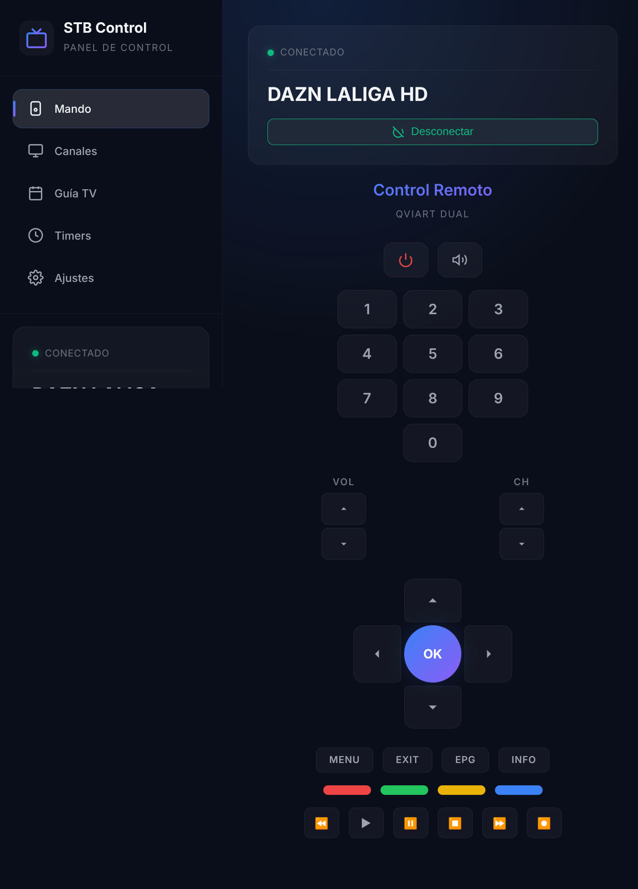
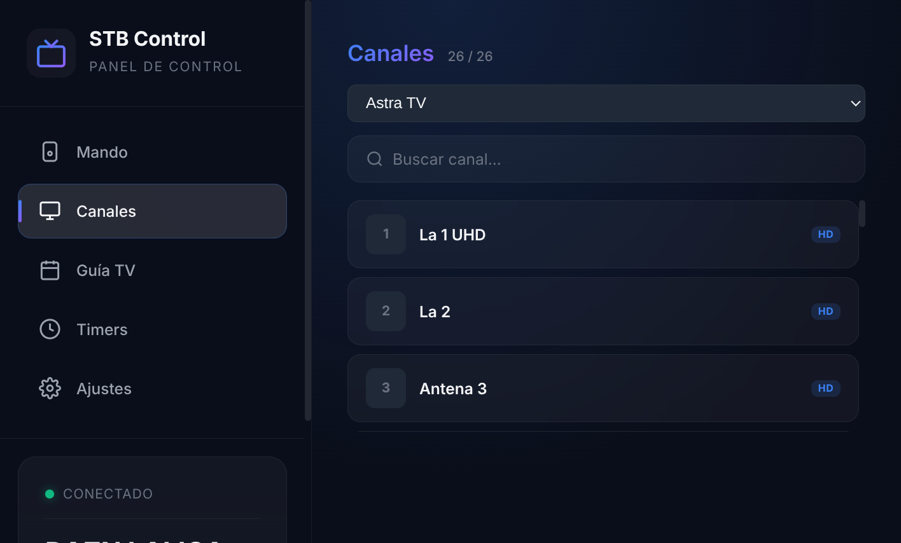
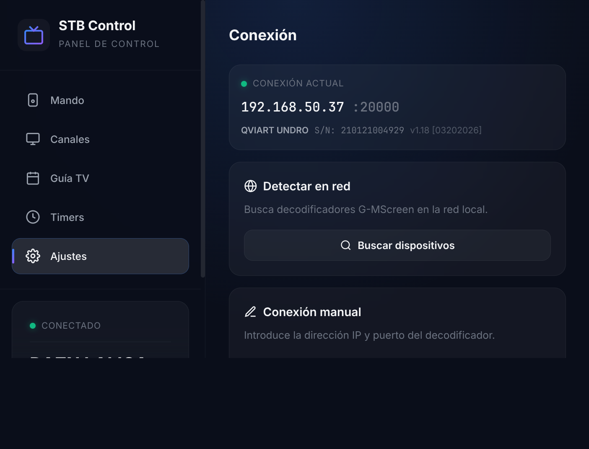

# G-MScreen Web Control

<p align="center">
  <strong>Panel de control web para decodificadores satélite con chipset ALi/Guoxin</strong><br>
  <em>Controla tu Qviart, Iris, Engel… desde el navegador</em>
</p>

<p align="center">
  
  
  
  
</p>

---

## Qué es esto

Un panel web self-hosted que reemplaza la app móvil **G-MScreen** para controlar decodificadores satélite basados en chipsets **ALi/Guoxin** (Qviart Dual/Undro, Iris, Engel, etc.) a través de la red local.

El protocolo propietario TCP del puerto 20000 fue completamente **ingeniería inversa** mediante un proxy MITM, permitiendo:

- 📺 **Mando a distancia virtual** completo (D-pad, números, colores, volumen, rec…)
- 📡 **Lista de canales** con zapping directo
- 📋 **Selector de bouquets** (listas de favoritos del deco)
- 📊 **Estado en tiempo real** (canal actual, señal, programa)
- 🔍 **Descubrimiento de red** automático (detecta STBs con su número de serie)
- ⚙️ **Gestión de conexión** manual o por detección automática

## Capturas

### Mando a distancia virtual


### Lista de canales con bouquets


### Ajustes de conexión


## Inicio rápido

### Docker (recomendado)

```bash
git clone https://github.com/tu-usuario/gmscreen.git
cd gmscreen
cp .env.example .env
docker compose up -d
```

La interfaz estará disponible en **http://localhost:8080**.

### Desarrollo local

**Requisitos:** Python 3.12+, Node.js 18+

```bash
# Backend
python -m venv .venv
source .venv/bin/activate
pip install -r backend/requirements.txt

# Frontend
cd frontend && npm install && cd ..

# Ejecutar (dos terminales)
cd frontend && npm run dev                                          # :5173
DATA_DIR=./data CONFIG_DIR=./config uvicorn backend.main:app \
  --host 0.0.0.0 --port 8080 --reload                              # :8080
```

El frontend en modo dev (`:5173`) usa un proxy a `:8080` para la API.

## Configuración

### Dispositivo

Edita `config/stb-control.yaml`:

```yaml
devices:
  - name: "Mi Decodificador"
    host: "192.168.1.100"   # IP de tu deco
    port: 20000             # Puerto G-MScreen (siempre 20000)
    adapter: "gmscreen"
```

O usa la interfaz web (pestaña **Ajustes**) para detectar automáticamente el deco en la red o configurar la IP manualmente.

### Variables de entorno

| Variable | Descripción | Default |
|----------|-------------|---------|
| `SECRET_KEY` | Clave secreta para sesiones | `dev-secret-change-me` |
| `TZ` | Zona horaria | `Europe/Madrid` |
| `LOG_LEVEL` | Nivel de log (`DEBUG`, `INFO`, `WARNING`) | `INFO` |
| `AUTH_USER` | Usuario de autenticación | `admin` |
| `AUTH_PASSWORD_HASH` | Hash de contraseña | `admin` |
| `CONFIG_DIR` | Ruta al directorio de configuración | `./config` |
| `DATA_DIR` | Ruta al directorio de datos | `./data` |

## Arquitectura

```
┌─────────────────────────────────────────────┐
│              Navegador Web                  │
│         (Svelte 5 + WebSocket)              │
└──────────────┬──────────────────────────────┘
               │ HTTP/WS :8080
┌──────────────▼──────────────────────────────┐
│           FastAPI Backend                   │
│  ┌─────────┐ ┌──────────┐ ┌─────────────┐  │
│  │  REST   │ │WebSocket │ │  Static     │  │
│  │  API    │ │ Manager  │ │  Frontend   │  │
│  └────┬────┘ └────┬─────┘ └─────────────┘  │
│       │           │                         │
│  ┌────▼───────────▼─────┐                   │
│  │   Adapter Registry   │                   │
│  │  ┌────────────────┐  │                   │
│  │  │ GMScreenAdapter│  │                   │
│  │  └───────┬────────┘  │                   │
│  └──────────│───────────┘                   │
└─────────────│───────────────────────────────┘
              │ TCP :20000
              │ Protocolo ALi/G-MScreen
┌─────────────▼───────────────────────────────┐
│       Decodificador Satélite                │
│    (Qviart Dual/Undro, Iris, Engel…)        │
└─────────────────────────────────────────────┘
```

## Estructura del proyecto

```
gmscreen/
├── backend/                  # Servidor Python (FastAPI)
│   ├── main.py               # Punto de entrada, lifespan, CORS
│   ├── api/
│   │   └── routes.py         # Endpoints REST + scan de red
│   ├── adapters/
│   │   ├── base.py           # Clase base abstracta
│   │   ├── gmscreen.py       # Adaptador protocolo ALi/G-MScreen
│   │   ├── registry.py       # Registro y factory de adaptadores
│   │   ├── enigma2.py        # Adaptador Enigma2 (placeholder)
│   │   └── mock.py           # Adaptador simulador
│   ├── core/
│   │   ├── config.py         # Carga de configuración YAML
│   │   ├── database.py       # SQLite async
│   │   ├── logging.py        # Structlog JSON
│   │   ├── websocket.py      # WebSocket manager
│   │   └── auth.py           # Autenticación
│   ├── models/
│   │   └── schemas.py        # Modelos Pydantic
│   ├── services/             # Lógica de negocio
│   └── requirements.txt
├── frontend/                 # Cliente web (Svelte 5 + Vite)
│   ├── src/
│   │   ├── App.svelte        # Layout principal con navegación
│   │   ├── lib/
│   │   │   ├── components/
│   │   │   │   ├── RemoteControl.svelte      # Mando virtual
│   │   │   │   ├── ChannelList.svelte        # Lista de canales
│   │   │   │   ├── StatusPanel.svelte        # Panel de estado
│   │   │   │   ├── EpgView.svelte            # Guía EPG
│   │   │   │   └── ConnectionSettings.svelte # Gestión conexión
│   │   │   ├── stores/
│   │   │   │   ├── websocket.js   # Estado STB en tiempo real
│   │   │   │   └── app.js         # Estado global UI
│   │   │   └── utils/
│   │   │       └── api.js         # Cliente HTTP para la API
│   │   └── main.js
│   └── package.json
├── scripts/                  # Herramientas de ingeniería inversa
│   ├── sniffer.py            # Proxy MITM para capturar protocolo
│   ├── capture_keys.py       # Captura interactiva de teclas
│   ├── explore_keys.py       # Exploración de códigos de teclas
│   ├── explore_requests.py   # Exploración de IDs de request
│   ├── fetch_channels.py     # Descarga de lista de canales
│   ├── retest_keys.py        # Re-test de teclas contextual
│   ├── test_zap.py           # Test de cambio de canal
│   └── data/                 # Datos capturados (keymaps, canales)
├── config/
│   └── stb-control.yaml      # Configuración del servidor
├── data/                     # Datos runtime (SQLite, claves ADB)
├── Dockerfile                # Build multi-stage (Node + Python)
├── docker-compose.yml        # Despliegue con Docker Compose
├── .env.example              # Variables de entorno de ejemplo
└── .gitignore
```

## Protocolo ALi/G-MScreen

El protocolo propietario opera sobre TCP puerto 20000:

### Peticiones (Cliente → STB)

```
Start{longitud_7_digitos}End{XML}
```

Ejemplo de ping:
```
Start0000080End<?xml version='1.0' encoding='UTF-8' standalone='yes' ?><Command request="26" />
```

### Respuestas (STB → Cliente)

Cabecera **GCDH** de 16 bytes + payload (opcionalmente comprimido con zlib):

```
[GCDH][4B magic][payload_len LE u32][8B reserved][zlib/raw XML payload]
```

### Comandos principales

| Request ID | Función | Notas |
|-----------|---------|-------|
| `998` | Registro de dispositivo | Respuesta RAW 108B (sin GCDH) |
| `15` | Info del STB | ProductName, SerialNumber, SoftwareVersion |
| `0` | Lista de canales | Paginado (100 por petición) |
| `1000` | Zap (cambiar canal) | Envía ProgramId del canal destino |
| `3` | Estado actual | Canal actual (ProgramId) |
| `12` | Bouquets | Listas de favoritos |
| `1040` | Pulsación de tecla | KeyValue numérico |
| `26` | Ping/keepalive | Mantiene la conexión activa |

### Handshake de conexión

```
998 (registro) → 32 → 18 → 22 → 20 → 16 → 15 (info STB)
```

### Restricción importante

El STB **solo acepta una conexión TCP simultánea**. Si se abre una segunda conexión, la primera se desconecta.

## Decodificadores compatibles

Probado con:
- **Qviart Undro** (ALi chipset)
- **Qviart Dual** (ALi chipset)

Debería funcionar con cualquier decodificador que use la app **G-MScreen** (puerto 20000), incluyendo:
- Iris (modelos con G-MScreen)
- Engel (modelos con G-MScreen)
- Otros basados en chipsets ALi/Guoxin

## API REST

| Método | Endpoint | Descripción |
|--------|----------|-------------|
| `GET` | `/api/health` | Health check |
| `GET` | `/api/status` | Estado actual del STB |
| `GET` | `/api/channels` | Lista de canales (TV) |
| `GET` | `/api/bouquets` | Bouquets disponibles |
| `POST` | `/api/channels/zap` | Cambiar de canal |
| `POST` | `/api/remote/key` | Enviar pulsación de tecla |
| `POST` | `/api/device/connect` | Conectar al STB |
| `POST` | `/api/device/disconnect` | Desconectar del STB |
| `GET` | `/api/network/scan` | Escanear red en busca de STBs |
| `POST` | `/api/device/configure` | Configurar IP/puerto del STB |
| `GET` | `/api/device/connection` | Info de conexión actual |
| `WS` | `/ws` | WebSocket (status, keypress, heartbeat) |

## Teclas del mando

| Tecla | Código | Tecla | Código |
|-------|--------|-------|--------|
| UP | 1 | MUTE | 23 |
| DOWN | 2 | VOL_UP | 35 |
| LEFT | 3 | VOL_DOWN | 36 |
| RIGHT | 4 | CH_UP | 37 |
| OK | 5 | CH_DOWN | 38 |
| MENU | 6 | POWER | 42 |
| EXIT | 7 | RED | 8 |
| BACK | 29 | GREEN | 9 |
| SAT | 30 | YELLOW | 10 |
| EPG | 32 | BLUE | 11 |
| TEXT | 34 | 0-9 | 12-21 |
| SUBTITLE | 31 | REC | 58 |
| TIMER | 26 | PLAY/STOP/PAUSE | 61/62/63 |

## Licencia

MIT
